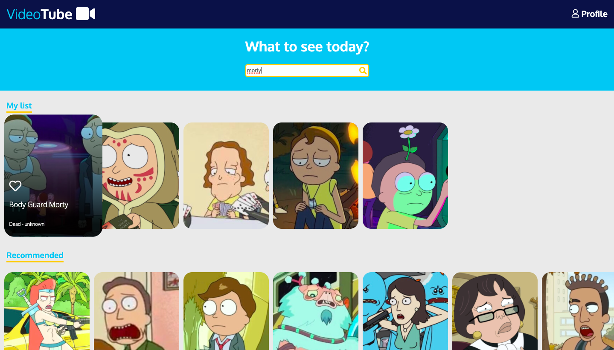
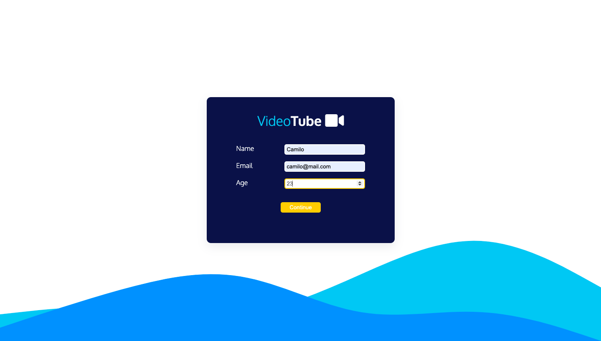
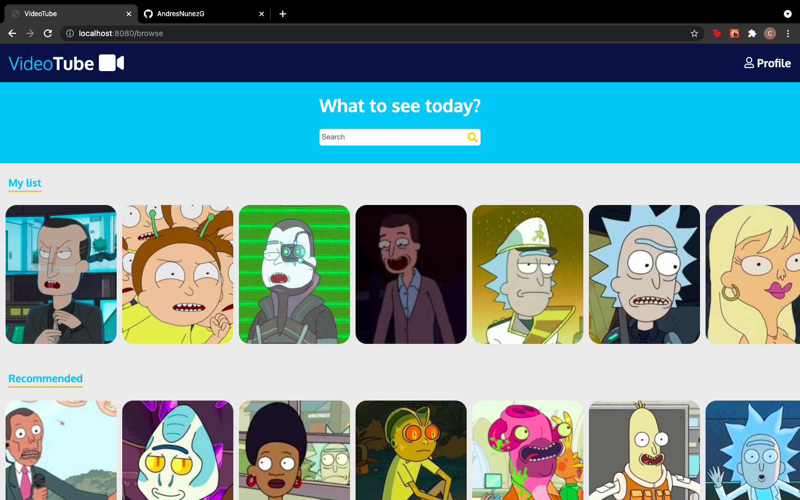
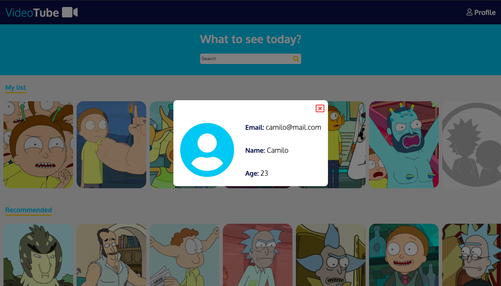
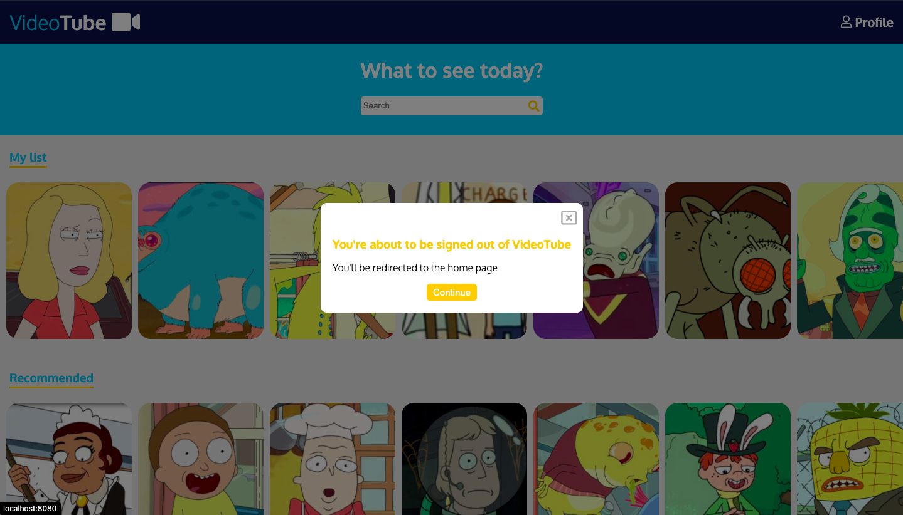

# VideoTube

Single page app that simulates a video platform with a login page that primarily uses ReactJS.

If you want to clone it, you'll need **`npm`** and **`nodeJS`**, among others.

## 🔹 Features

### 🔸 Like option

Like any card you want

### 🔸 Search with filters

Filter MyList Carousel by name, status or origin

### 🔸 Functional Login without Auth

## 🔹 Technology

These are the Technologies and tools used for the project

- ReactJS
- React Router DOM
- Webpack
- ESLint
- Babel
- Sass
- React Hooks

## 🔹 Screenshots

### 🔸 Login

### 🔸 Browser

### 🔸 Page not found

### 🔸 Account Modal

### 🔸 Sign out Modal

**from**: 🇨🇴  
**by**: Andrés Núñez
